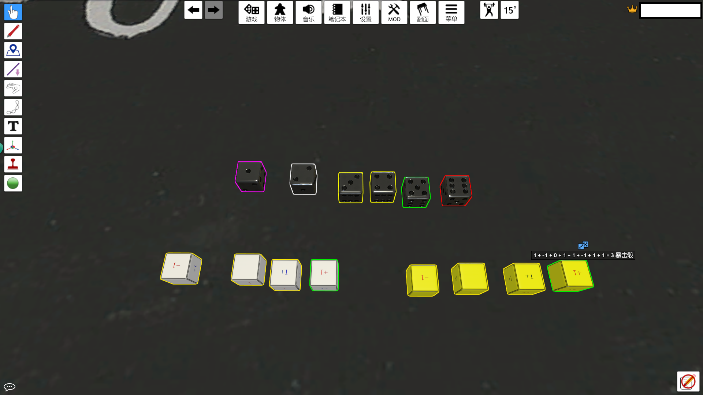

# 屠龙远征快速开局脚本
本脚本是用于桌游模拟器的lua脚本。感谢SZ382031810在桌游模拟器制作的[屠龙远征MOD](https://steamcommunity.com/sharedfiles/filedetails/?id=2908114886)，本脚本基于此MOD运行，对玩家选择的扩展包进行自动摆盘，方便快速开局。本脚本已集成到原MOD中，直接订阅即可。

## 脚本特性
1. 可以任选想要使用的扩展包，快速开启一局游戏，依据所选扩展包内容，自动拿取所有所需的物品，随机布置地图上的山、任务、遗迹、异境、暗黑之剑移动标记、航路等各种标记；
2. 角色卡和角色徽章会被以玩家颜色高亮；
   
3. 骰子被附加了更为显眼的脚本：
    + 移动骰：在1点时为紫色高亮，2点会有白色高亮，3点会有黄色高亮，4\~5点绿色高亮，6点红色高亮，分别对应了游戏中无法行动、城市/村庄/道路、平原、森林、龙怒进度上升。使用地图4，帝都决战时，1\~2点为白色高亮，3\~5点为绿色高亮，6点红色高亮。
    + 判定骰：骰子值已经按照游戏规则换算，框选后投骰子，在结束移动后骰子值会自动合计。骰子为6点时，会被附加绿色高亮，
    + 暴击骰：在判定骰投出6点后使用，数值已按照暴击规则换算，在投出6点时也会被附加绿色高亮。同样可以和判定骰一起框选合计数值。
    

## 前期准备
1. 在STEAM下载[桌游模拟器](https://store.steampowered.com/app/286160/Tabletop_Simulator/)；
2. 订阅[SZ382031810在桌游模拟器制作的MOD](https://steamcommunity.com/sharedfiles/filedetails/?id=2908114886)；
3. 创建一个房间打开此MOD，将图中红色标注的范围空出来，否则可能造成模型碰撞；
   
4. 在"MOD-脚本"中填入本脚本的内容，点击"保存并启动"；
   
5. 此时游戏会提示无法保存，请创建自己的存档，点击"游戏-保存和载入-保存游戏"，此界面将保存为一个存档。
6. 之后从这个存档启动即可；

## 使用步骤
1. 脚本启动后在左上会生成一个面板，其中可以选择扩展包和地图。白色为未选择，灰色为已选择
2. 选择完成后在空白区域点击右键，选择载入，所选扩展包内容就会自动布置到桌面上
3. 各个玩家在已就坐的情况下将自己选择的角色卡拖入手牌区
4. 在空白处点击右键，选择开始，角色卡对应的徽章会被放置到地图的城市，会给每个玩家一组指示物。未使用的角色卡和徽章会归位，在选择了#7魔龙守护者扩展包的情况下，故事面板会被摆放到桌面
5. **由于桌游模拟器机制问题想要重新开局必须重新加载存档**

## 目前的不足
1. 暂不支持强大的龙
2. 暂不支持一人持多卡、一人扮演多个玩家，不是就坐玩家的牌在开始后会被收走
3. 暗黑之剑选为己方角色后仍然会被放置到暗黑之剑起始位置
4. 萨满不支持自动放置到地图2开局地点
5. 暂不支持随从
6. 暂不支持角色卡标志物自动放置（要花时间搜集角色数据）
7. 暂不支持自动结算（自动结算代码量大，且会在一定程度上破坏桌游的乐趣，以后再考虑）
8. 快速重新开局（目前需要重载游戏存档进行重开，步骤相对繁琐。但由于桌游模拟器的MOD数据均为游戏数据快照，官方没有提供重载游戏存档的API，想要在代码上实现重载，需要将所有物件的初始状态保存在内存中，造成额外负担，目前没有找到比较好的实现方法）
9. 脚本虽然经过了测试，但有些lua的异步特性没有仔细考虑，可能某些情况下会出现BUG，可能重新加载一次可能就没问题了。如果有什么能够描述清楚并复现的问题请在本项目的issue留言。

以上问题涉及的手动操作很少，自己移动一下就好，现在又不是不能用，欸嘿！